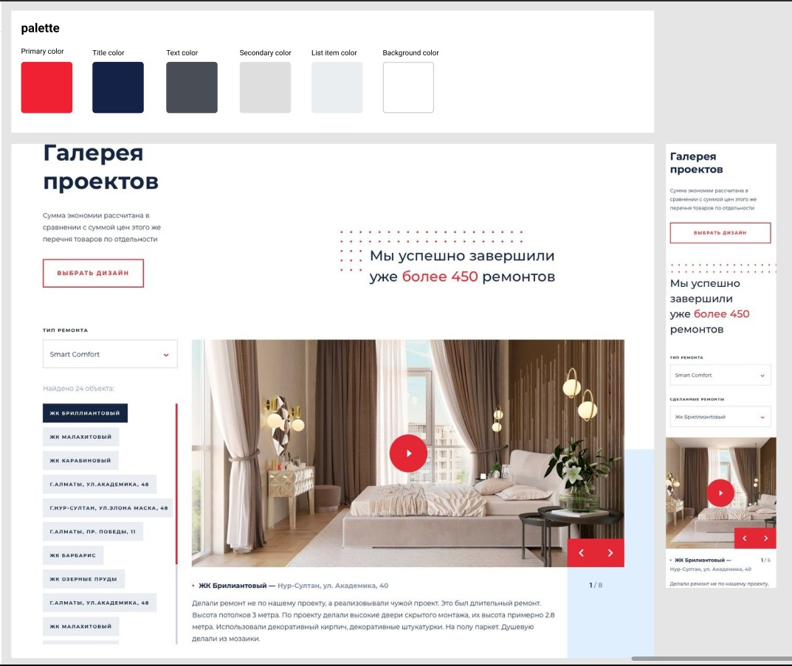
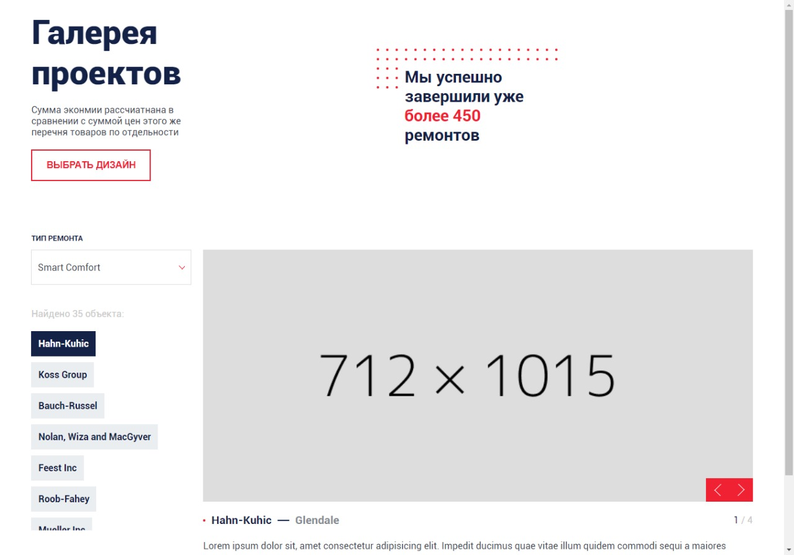
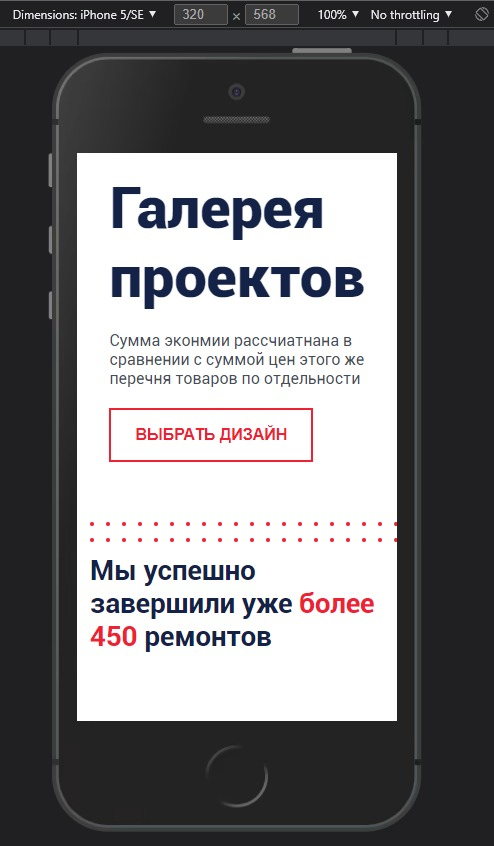
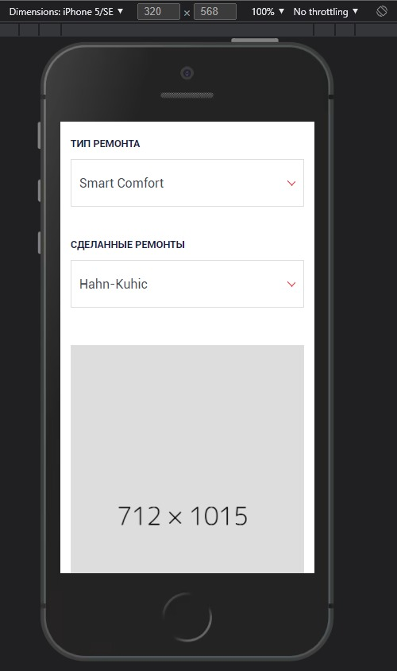
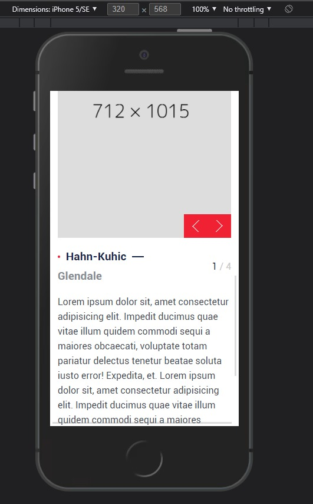

# [Assignment_2021_11_18](https://assignment_2021_11_18.surge.sh) &middot; v0.0.1

> 一个面试任务...

## 任务截图

### 设计稿

### 桌面端

### 移动端 1

### 移动端 2

### 移动端 3

---

### License

This is [MIT license](./LICENSE)。
